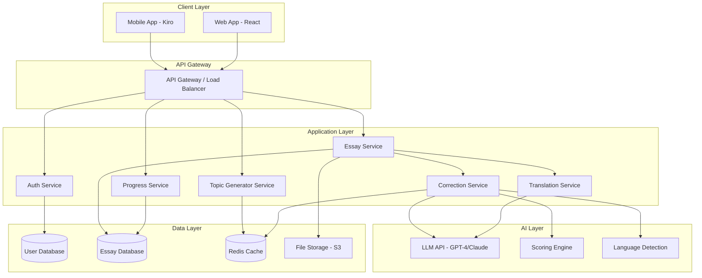

# Design Document - ESSAYTO AI Essay Coach

## Overview

ESSAYTO is a cross-platform (mobile and web) AI-powered essay coaching system that provides real-time writing feedback, corrections, and personalized learning paths across Indonesian, Chinese, and English languages. The system architecture follows a client-server model with a React-based frontend (using Kiro for mobile), a Node.js/Express backend, and integration with LLM APIs for AI-powered corrections.

### Design Principles

- **Performance First**: Sub-4-second response times for essay analysis
- **Mobile-First UI**: Responsive design optimized for mobile with web compatibility
- **Scalability**: Support for 50k MAU with horizontal scaling capability
- **Privacy by Design**: Encrypted storage and GDPR compliance built-in
- **Offline Capability**: Local draft storage with sync when online

## Architecture

### High-Level Architecture



### Technology Stack

**Frontend:**
- React 18+ with TypeScript
- Kiro framework for mobile deployment
- TailwindCSS for styling
- React Query for state management and caching
- IndexedDB for offline storage

**Backend:**
- Node.js 20+ with Express
- TypeScript
- JWT for authentication
- Bull for job queues (async processing)

**AI/ML:**
- OpenAI GPT-4 or Anthropic Claude API
- Custom scoring algorithms
- Language detection library (franc or similar)

**Database:**
- PostgreSQL for relational data (users, essays, scores)
- Redis for caching and session management
- AWS S3 or similar for PDF storage

**Infrastructure:**
- Docker containers
- Kubernetes for orchestration
- NGINX as reverse proxy
- CloudFlare for CDN and DDoS protection

## Components and Interfaces

### 1. Frontend Components

#### 1.1 Essay Editor Component

**Purpose:** Main text input interface with real-time validation

**Key Features:**
- Rich text editor with syntax highlighting
- Character counter (max 10,000)
- Auto-save every 30 seconds
- Language selector dropdown
- File upload button

**State Management:**
```typescript
interface EditorState {
  content: string;
  language: 'id' | 'zh' | 'en' | 'auto';
  isDirty: boolean;
  lastSaved: Date | null;
  charCount: number;
}
```

**API Integration:**
- `POST /api/essays/draft` - Save draft
- `POST /api/essays/submit` - Submit for correction

#### 1.2 Correction Display Component

**Purpose:** Show inline corrections with explanations

**Key Features:**
- Highlight incorrect words/sentences
- Tooltip explanations on hover/tap
- Toggle corrections on/off
- Side-by-side original vs corrected view
- Final polished version at bottom

**Data Structure:**
```typescript
interface Correction {
  id: string;
  type: 'grammar' | 'vocabulary' | 'structure' | 'style';
  originalText: string;
  correctedText: string;
  explanation: string;
  position: { start: number; end: number };
  severity: 'error' | 'warning' | 'suggestion';
}

interface CorrectionResult {
  corrections: Correction[];
  polishedVersion: string;
  score: Score;
}
```

#### 1.3 Score Dashboard Component

**Purpose:** Display overall and detailed scores

**Key Features:**
- Circular progress indicator for overall score (0-100)
- Bar charts for subscores
- Color coding (red <60, yellow 60-79, green 80+)
- Comparison with previous essays

**Score Interface:**
```typescript
interface Score {
  overall: number;
  grammar: number;
  vocabulary: number;
  structure: number;
  fluency: number;
  coherence: number;
  timestamp: Date;
}
```

#### 1.4 Progress Tracking Component

**Purpose:** Visualize user improvement over time

**Key Features:**
- Line chart showing score trends
- Statistics cards (total essays, avg score, improvement %)
- Weakness identification
- Rank badge display (Bronze → Diamond)

**Progress Interface:**
```typescript
interface UserProgress {
  totalEssays: number;
  averageScore: number;
  weeklyImprovement: number;
  weaknesses: Array<{
    category: string;
    frequency: number;
  }>;
  rank: 'bronze' | 'silver' | 'gold' | 'platinum' | 'diamond';
  achievements: Achievement[];
}
```

#### 1.5 Topic Generator Component

**Purpose:** Provide personalized writing prompts

**Key Features:**
- Mode selector (Academic, Professional, Creative, Exam-prep)
- Difficulty slider
- Language selector
- Random topic button
- Topic history

**Topic Interface:**
```typescript
interface Topic {
  id: string;
  title: string;
  description: string;
  mode: 'academic' | 'professional' | 'creative' | 'exam';
  difficulty: 1 | 2 | 3 | 4 | 5;
  language: 'id' | 'zh' | 'en';
  targetWeakness?: string;
}
```

#### 1.6 Essay Library Component

**Purpose:** Browse and manage saved essays

**Key Features:**
- Grid/list view toggle
- Search bar
- Filters (date, language, score, topic)
- Sort options
- Delete confirmation modal

### 2. Backend Services

#### 2.1 Authentication Service

**Endpoints:**
- `POST /api/auth/register` - Create new user
- `POST /api/auth/login` - Authenticate user
- `POST /api/auth/refresh` - Refresh JWT token
- `POST /api/auth/logout` - Invalidate session
- `DELETE /api/auth/account` - Delete user account (GDPR)

**Security:**
- bcrypt for password hashing (12 rounds)
- JWT with 1-hour access token, 7-day refresh token
- Rate limiting: 5 login attempts per 15 minutes

#### 2.2 Essay Service

**Endpoints:**
- `POST /api/essays/draft` - Save draft essay
- `POST /api/essays/submit` - Submit essay for correction
- `GET /api/essays/:id` - Retrieve specific essay
- `GET /api/essays` - List user's essays (paginated)
- `DELETE /api/essays/:id` - Delete essay
- `GET /api/essays/:id/pdf` - Export essay as PDF

**Business Logic:**
- Validate essay length (max 10,000 chars)
- Auto-detect language if not specified
- Queue essay for async processing
- Store original and corrected versions
- Generate PDF on demand

#### 2.3 Correction Service

**Core Functionality:**

This service orchestrates the AI correction pipeline:

1. **Language Detection**
   - Use language detection library for auto-detection
   - Validate against supported languages (ID, ZH, EN)

2. **Grammar & Vocabulary Correction**
   - Send essay to LLM with specialized prompt
   - Parse LLM response into structured corrections
   - Identify error positions in original text

3. **Structure & Style Analysis**
   - Analyze sentence structure
   - Check coherence and flow
   - Suggest improvements

4. **Scoring**
   - Calculate subscores based on error frequency and severity
   - Apply weighted formula for overall score
   - Compare against historical data for accuracy

**LLM Prompt Template:**
```
You are an expert writing coach. Analyze the following essay in [LANGUAGE] and provide:

1. Grammar errors with corrections
2. Vocabulary improvements
3. Structure suggestions
4. A polished final version

Essay:
[ESSAY_TEXT]

Return response in JSON format:
{
  "corrections": [
    {
      "type": "grammar|vocabulary|structure",
      "original": "text",
      "corrected": "text",
      "explanation": "reason",
      "position": {"start": 0, "end": 10}
    }
  ],
  "polishedVersion": "full corrected essay"
}
```

**Scoring Algorithm:**
```typescript
function calculateScore(corrections: Correction[], essayLength: number): Score {
  const errorDensity = corrections.length / (essayLength / 100);
  
  // Base score starts at 100, deduct points for errors
  const grammarErrors = corrections.filter(c => c.type === 'grammar');
  const vocabErrors = corrections.filter(c => c.type === 'vocabulary');
  const structureErrors = corrections.filter(c => c.type === 'structure');
  
  const grammarScore = Math.max(0, 100 - (grammarErrors.length * 3));
  const vocabularyScore = Math.max(0, 100 - (vocabErrors.length * 2));
  const structureScore = Math.max(0, 100 - (structureErrors.length * 4));
  
  // Fluency and coherence based on error density and structure
  const fluencyScore = Math.max(0, 100 - (errorDensity * 5));
  const coherenceScore = structureScore * 0.8 + fluencyScore * 0.2;
  
  const overall = (
    grammarScore * 0.25 +
    vocabularyScore * 0.20 +
    structureScore * 0.25 +
    fluencyScore * 0.15 +
    coherenceScore * 0.15
  );
  
  return {
    overall: Math.round(overall),
    grammar: Math.round(grammarScore),
    vocabulary: Math.round(vocabularyScore),
    structure: Math.round(structureScore),
    fluency: Math.round(fluencyScore),
    coherence: Math.round(coherenceScore),
    timestamp: new Date()
  };
}
```

#### 2.4 Progress Service

**Endpoints:**
- `GET /api/progress` - Get user progress summary
- `GET /api/progress/trends` - Get score trends over time
- `GET /api/progress/weaknesses` - Get identified weaknesses
- `GET /api/progress/achievements` - Get earned achievements

**Analytics Logic:**
- Calculate rolling averages (7-day, 30-day)
- Identify weakness patterns from correction history
- Determine rank based on essay count and average score
- Track achievement milestones

**Rank Calculation:**
```typescript
function calculateRank(essayCount: number, avgScore: number): Rank {
  if (essayCount < 5) return 'bronze';
  if (essayCount < 15 || avgScore < 60) return 'bronze';
  if (essayCount < 30 || avgScore < 70) return 'silver';
  if (essayCount < 50 || avgScore < 80) return 'gold';
  if (essayCount < 100 || avgScore < 90) return 'platinum';
  return 'diamond';
}
```

#### 2.5 Topic Generator Service

**Endpoints:**
- `POST /api/topics/generate` - Generate personalized topic
- `GET /api/topics/history` - Get previously used topics

**Generation Logic:**
```typescript
interface TopicGenerationRequest {
  mode: 'academic' | 'professional' | 'creative' | 'exam';
  language: 'id' | 'zh' | 'en';
  userRank: Rank;
  weaknesses?: string[];
}

async function generateTopic(req: TopicGenerationRequest): Promise<Topic> {
  // Determine difficulty based on rank
  const difficulty = rankToDifficulty(req.userRank);
  
  // Build prompt targeting weaknesses
  const weaknessContext = req.weaknesses?.length 
    ? `Focus on topics that practice: ${req.weaknesses.join(', ')}`
    : '';
  
  const prompt = `Generate a ${req.mode} writing topic in ${req.language} 
    at difficulty level ${difficulty}/5. ${weaknessContext}
    
    Return JSON: { "title": "...", "description": "..." }`;
  
  const response = await callLLM(prompt);
  
  return {
    id: generateId(),
    ...response,
    mode: req.mode,
    difficulty,
    language: req.language,
    targetWeakness: req.weaknesses?.[0]
  };
}
```

#### 2.6 Translation Service

**Endpoints:**
- `POST /api/translate` - Translate essay between languages

**Implementation:**
- Use LLM for high-quality translation
- Maintain context and tone
- Cache common translations

### 3. Data Models

#### 3.1 User Model

```typescript
interface User {
  id: string;
  email: string;
  passwordHash: string;
  username: string;
  preferredLanguage: 'id' | 'zh' | 'en';
  createdAt: Date;
  lastLoginAt: Date;
  settings: {
    uiLanguage: 'id' | 'zh' | 'en';
    emailNotifications: boolean;
    theme: 'light' | 'dark';
  };
}
```

**Database Schema (PostgreSQL):**
```sql
CREATE TABLE users (
  id UUID PRIMARY KEY DEFAULT gen_random_uuid(),
  email VARCHAR(255) UNIQUE NOT NULL,
  password_hash VARCHAR(255) NOT NULL,
  username VARCHAR(100) NOT NULL,
  preferred_language VARCHAR(2) DEFAULT 'en',
  created_at TIMESTAMP DEFAULT NOW(),
  last_login_at TIMESTAMP,
  settings JSONB DEFAULT '{}',
  CONSTRAINT email_format CHECK (email ~* '^[A-Za-z0-9._%+-]+@[A-Za-z0-9.-]+\.[A-Za-z]{2,}$')
);

CREATE INDEX idx_users_email ON users(email);
```

#### 3.2 Essay Model

```typescript
interface Essay {
  id: string;
  userId: string;
  originalText: string;
  language: 'id' | 'zh' | 'en';
  corrections: Correction[];
  polishedVersion: string;
  score: Score;
  topic?: Topic;
  status: 'draft' | 'processing' | 'completed' | 'failed';
  createdAt: Date;
  completedAt?: Date;
}
```

**Database Schema:**
```sql
CREATE TABLE essays (
  id UUID PRIMARY KEY DEFAULT gen_random_uuid(),
  user_id UUID NOT NULL REFERENCES users(id) ON DELETE CASCADE,
  original_text TEXT NOT NULL,
  language VARCHAR(2) NOT NULL,
  corrections JSONB DEFAULT '[]',
  polished_version TEXT,
  score JSONB,
  topic JSONB,
  status VARCHAR(20) DEFAULT 'draft',
  created_at TIMESTAMP DEFAULT NOW(),
  completed_at TIMESTAMP,
  CONSTRAINT text_length CHECK (char_length(original_text) <= 10000)
);

CREATE INDEX idx_essays_user_id ON essays(user_id);
CREATE INDEX idx_essays_status ON essays(status);
CREATE INDEX idx_essays_created_at ON essays(created_at DESC);
```

#### 3.3 Progress Model

```typescript
interface ProgressSnapshot {
  id: string;
  userId: string;
  totalEssays: number;
  averageScore: number;
  weeklyImprovement: number;
  weaknesses: Array<{ category: string; count: number }>;
  rank: Rank;
  snapshotDate: Date;
}
```

**Database Schema:**
```sql
CREATE TABLE progress_snapshots (
  id UUID PRIMARY KEY DEFAULT gen_random_uuid(),
  user_id UUID NOT NULL REFERENCES users(id) ON DELETE CASCADE,
  total_essays INTEGER NOT NULL,
  average_score DECIMAL(5,2),
  weekly_improvement DECIMAL(5,2),
  weaknesses JSONB DEFAULT '[]',
  rank VARCHAR(20),
  snapshot_date DATE DEFAULT CURRENT_DATE,
  UNIQUE(user_id, snapshot_date)
);

CREATE INDEX idx_progress_user_date ON progress_snapshots(user_id, snapshot_date DESC);
```

## Error Handling

### Frontend Error Handling

**Network Errors:**
- Display user-friendly error messages
- Implement retry logic with exponential backoff
- Show offline indicator when network unavailable
- Queue actions for retry when connection restored

**Validation Errors:**
- Inline validation messages
- Prevent submission of invalid data
- Clear error states on user correction

**Error Boundary Component:**
```typescript
class ErrorBoundary extends React.Component {
  componentDidCatch(error: Error, errorInfo: React.ErrorInfo) {
    // Log to error tracking service
    logError(error, errorInfo);
    
    // Show fallback UI
    this.setState({ hasError: true });
  }
  
  render() {
    if (this.state.hasError) {
      return <ErrorFallback onReset={() => this.setState({ hasError: false })} />;
    }
    return this.props.children;
  }
}
```

### Backend Error Handling

**Error Response Format:**
```typescript
interface ErrorResponse {
  error: {
    code: string;
    message: string;
    details?: any;
    timestamp: string;
  };
}
```

**Error Categories:**

1. **Validation Errors (400)**
   - Invalid input format
   - Missing required fields
   - Text length exceeded

2. **Authentication Errors (401)**
   - Invalid credentials
   - Expired token
   - Missing authentication

3. **Authorization Errors (403)**
   - Insufficient permissions
   - Account suspended

4. **Not Found Errors (404)**
   - Essay not found
   - User not found

5. **Rate Limit Errors (429)**
   - Too many requests
   - Quota exceeded

6. **Server Errors (500)**
   - LLM API failure
   - Database connection error
   - Unexpected errors

**Error Handling Middleware:**
```typescript
function errorHandler(err: Error, req: Request, res: Response, next: NextFunction) {
  // Log error with context
  logger.error({
    error: err.message,
    stack: err.stack,
    path: req.path,
    method: req.method,
    userId: req.user?.id
  });
  
  // Determine error type and status code
  const statusCode = err instanceof ValidationError ? 400 :
                     err instanceof AuthError ? 401 :
                     err instanceof NotFoundError ? 404 : 500;
  
  // Send error response
  res.status(statusCode).json({
    error: {
      code: err.name,
      message: err.message,
      timestamp: new Date().toISOString()
    }
  });
}
```

### LLM API Error Handling

**Retry Strategy:**
- Implement exponential backoff (1s, 2s, 4s)
- Maximum 3 retry attempts
- Fallback to cached responses if available
- Queue for manual review if all retries fail

**Timeout Handling:**
- Set 30-second timeout for LLM requests
- Return partial results if available
- Notify user of processing delay

## Testing Strategy

### Unit Testing

**Frontend:**
- Test individual components in isolation
- Mock API calls and external dependencies
- Test state management logic
- Aim for 80%+ code coverage

**Tools:** Jest, React Testing Library

**Example Test:**
```typescript
describe('EditorComponent', () => {
  it('should auto-save draft every 30 seconds', async () => {
    const mockSaveDraft = jest.fn();
    render(<EditorComponent onSaveDraft={mockSaveDraft} />);
    
    const input = screen.getByRole('textbox');
    fireEvent.change(input, { target: { value: 'Test essay' } });
    
    await waitFor(() => expect(mockSaveDraft).toHaveBeenCalled(), {
      timeout: 31000
    });
  });
});
```

**Backend:**
- Test service functions independently
- Mock database and external API calls
- Test error handling paths
- Validate data transformations

**Tools:** Jest, Supertest

### Integration Testing

**API Integration:**
- Test complete request/response cycles
- Verify authentication flows
- Test database transactions
- Validate error responses

**Example Test:**
```typescript
describe('POST /api/essays/submit', () => {
  it('should process essay and return corrections', async () => {
    const token = await getAuthToken();
    
    const response = await request(app)
      .post('/api/essays/submit')
      .set('Authorization', `Bearer ${token}`)
      .send({
        text: 'This are a test essay.',
        language: 'en'
      });
    
    expect(response.status).toBe(200);
    expect(response.body.corrections).toHaveLength(1);
    expect(response.body.score.overall).toBeGreaterThan(0);
  });
});
```

### End-to-End Testing

**User Flows:**
- Complete essay submission and correction flow
- Progress tracking and analytics
- Topic generation and essay writing
- PDF export functionality

**Tools:** Playwright or Cypress

**Example Test:**
```typescript
test('complete essay correction flow', async ({ page }) => {
  await page.goto('/');
  await page.click('text=New Essay');
  
  await page.fill('[data-testid="essay-editor"]', 'This are my essay.');
  await page.click('text=Submit for Correction');
  
  await page.waitForSelector('[data-testid="corrections"]');
  
  const score = await page.textContent('[data-testid="overall-score"]');
  expect(parseInt(score)).toBeGreaterThan(0);
});
```

### Performance Testing

**Load Testing:**
- Simulate 1000 concurrent users
- Test essay submission under load
- Measure response times at 50th, 95th, 99th percentiles
- Identify bottlenecks

**Tools:** k6, Artillery

**Metrics to Track:**
- API response times
- Database query performance
- LLM API latency
- Memory usage
- CPU utilization

### Security Testing

**Vulnerability Scanning:**
- SQL injection testing
- XSS prevention validation
- CSRF token verification
- Authentication bypass attempts
- Rate limiting effectiveness

**Tools:** OWASP ZAP, Burp Suite

## Performance Optimization

### Frontend Optimization

1. **Code Splitting**
   - Lazy load routes
   - Dynamic imports for heavy components
   - Separate vendor bundles

2. **Caching Strategy**
   - Cache API responses with React Query
   - IndexedDB for offline essay drafts
   - Service Worker for static assets

3. **Rendering Optimization**
   - Virtualize long lists (essay library)
   - Debounce search inputs
   - Memoize expensive computations

### Backend Optimization

1. **Database Optimization**
   - Index frequently queried columns
   - Use connection pooling
   - Implement query result caching
   - Paginate large result sets

2. **API Optimization**
   - Implement Redis caching for:
     - User sessions
     - Topic generation results
     - Common translations
   - Use CDN for static assets
   - Compress responses with gzip

3. **LLM API Optimization**
   - Batch similar requests
   - Cache common correction patterns
   - Implement request queuing
   - Use streaming responses for long essays

### Caching Strategy

**Cache Layers:**

1. **Browser Cache** (1 hour)
   - Static assets (JS, CSS, images)
   - User profile data

2. **Redis Cache** (varies)
   - User sessions (7 days)
   - Generated topics (1 hour)
   - Translation results (24 hours)
   - Progress snapshots (1 hour)

3. **CDN Cache** (24 hours)
   - Static assets
   - Public content

**Cache Invalidation:**
- Invalidate user cache on profile update
- Invalidate essay cache on new submission
- Invalidate progress cache on essay completion

## Deployment Architecture

### Infrastructure

**Production Environment:**
```
┌─────────────────┐
│   CloudFlare    │ (CDN, DDoS Protection)
└────────┬────────┘
         │
┌────────▼────────┐
│  Load Balancer  │ (NGINX)
└────────┬────────┘
         │
    ┌────┴────┐
    │         │
┌───▼──┐  ┌──▼───┐
│ API  │  │ API  │ (Node.js containers)
│ Pod 1│  │ Pod 2│
└───┬──┘  └──┬───┘
    │        │
    └────┬───┘
         │
┌────────▼────────┐
│   PostgreSQL    │ (Primary + Replica)
└─────────────────┘
         │
┌────────▼────────┐
│     Redis       │ (Cache + Sessions)
└─────────────────┘
```

### Scaling Strategy

**Horizontal Scaling:**
- Auto-scale API pods based on CPU (>70%)
- Minimum 2 pods, maximum 10 pods
- Scale database read replicas for read-heavy loads

**Vertical Scaling:**
- Increase pod resources during peak hours
- Scale database instance for storage growth

### Monitoring and Observability

**Metrics to Track:**
- Request rate and latency (p50, p95, p99)
- Error rate by endpoint
- Database connection pool usage
- Cache hit/miss ratio
- LLM API response times
- User engagement metrics (DAU, essay completion rate)

**Tools:**
- Prometheus for metrics collection
- Grafana for visualization
- Sentry for error tracking
- CloudWatch for infrastructure monitoring

**Alerts:**
- API response time > 6 seconds
- Error rate > 5%
- Database connection pool > 80%
- Disk usage > 85%
- LLM API failure rate > 10%

## Security Considerations

### Authentication & Authorization

- JWT-based authentication
- Refresh token rotation
- Role-based access control (future: admin, user)
- Rate limiting per user and IP

### Data Protection

- Encrypt essays at rest (AES-256)
- Encrypt data in transit (TLS 1.3)
- Secure password storage (bcrypt, 12 rounds)
- Regular security audits

### GDPR Compliance

- User data export functionality
- Account deletion with data purge
- Cookie consent management
- Privacy policy and terms of service
- Data retention policies (essays kept for 2 years)

### API Security

- Input validation and sanitization
- SQL injection prevention (parameterized queries)
- XSS prevention (content security policy)
- CSRF protection
- Rate limiting (100 requests/minute per user)

## Future Enhancements

### Phase 2 Features

1. **Collaborative Writing**
   - Share essays with peers for review
   - Real-time collaborative editing
   - Peer feedback system

2. **Voice Input**
   - Speech-to-text for essay dictation
   - Support for all three languages

3. **Advanced Analytics**
   - Writing style analysis
   - Readability scores
   - Plagiarism detection

4. **Gamification**
   - Daily writing challenges
   - Leaderboards
   - Badges and rewards
   - Streak tracking

5. **Mobile App Features**
   - Push notifications for achievements
   - Offline mode with full functionality
   - Widget for quick essay access

### Monetization Strategy

**Freemium Model:**
- Free tier: 10 essays/month, basic corrections
- Premium tier ($9.99/month): Unlimited essays, advanced analytics, priority processing
- Pro tier ($19.99/month): All premium features + API access, custom topics

## Conclusion

This design provides a comprehensive, scalable architecture for ESSAYTO that meets all requirements while maintaining performance, security, and user experience standards. The modular service-based architecture allows for independent scaling and future feature additions without major refactoring.

Key design decisions:
- **Microservices approach** for scalability and maintainability
- **LLM integration** for high-quality corrections and translations
- **Caching strategy** to meet sub-4-second response time requirements
- **Mobile-first UI** with offline capabilities
- **Privacy-focused** with encryption and GDPR compliance built-in

The system is designed to support 50k MAU with room for growth, while maintaining the performance and quality standards required for an excellent user experience.
